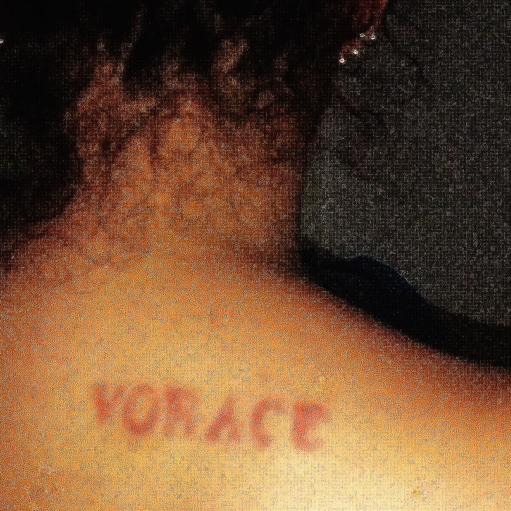

## Vorace - Cloine ##

"Vorace" est un morceau de Cloine, composé entièrement de sa voix modifiée pour créer un paysage sonore oppressant et envoûtant à la fois.
Cette page propose une façon différente d'écouter la musique. Vous pouvez dessiner une forme kaléidoscopique à la l'aide votre souris ou de votre doigt sur l'écran, et selon sa position, le son réagira en accélèrant ou en ralentissant.
Ce projet a été réalisé dans le cadre d'une exposition.

Le fonctionnement de la page est basé sur deux modules disponibles sur [p5js](https://p5js.org) :
* [Kaleidoscope](https://p5js.org/examples/repetition-kaleidoscope/)
* [Audio player](https://p5js.org/examples/imported-media-create-audio/)
--------
Écouter Cloine :
* [YouTube](https://www.youtube.com/@cloine/releases)
* [SoundCloud](https://www.soundcloud.com/aliascloine)
* [Bandcamp](https://cloine.bandcamp.com/)
* [Deezer](https://link.deezer.com/s/33yaQoD6a6obrC1ophFW3)

Un grand merci à Jayce Salez pour son aide.